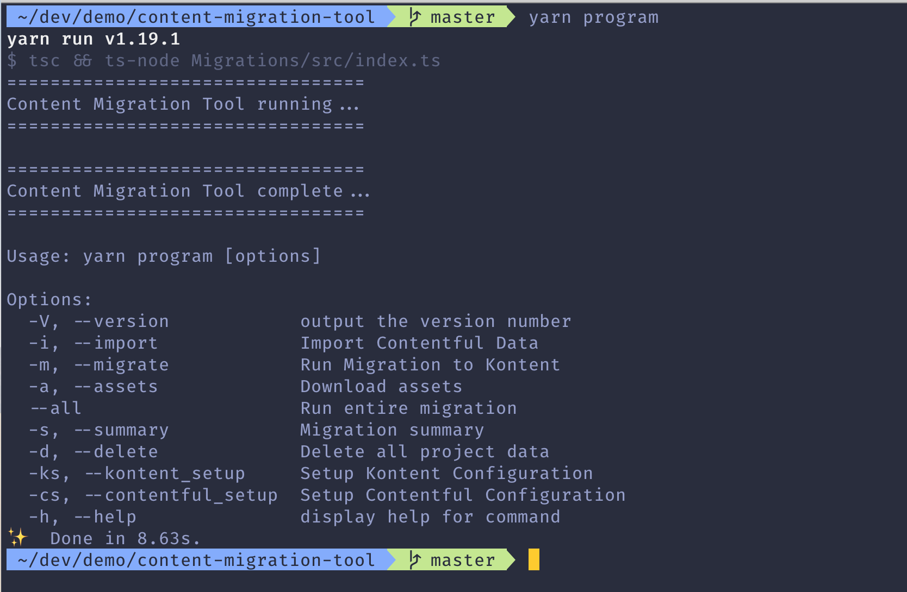

<h1 align="center">Welcome to Contentful to Kentico Kontent Migration Tool 👋</h1>

Tool to migrate content + assets from Contentful CMS over to Kontent.

## Prerequisites

[yarn](https://yarnpkg.com/), a UNIX system (on windows, this is possible by using Git Bash terminal client, or similar)

## Install

1. Clone this repository `git clone https://github.com/Kentico/kontent-migration-contentful.git`

2. cd into the project `cd kontent-migration-contentful`

3. Install package dependencies

```sh 
yarn 
```

4. Compile TypeScript 

```sh 
yarn build
```

## Usage

Start the script to run the Content migration tool program.

```sh 
yarn program
```




### Steps
1. Setup Kontent config

```sh 
yarn program --kontent_setup 
```
* Kontent project id
* Kontent management token


2. Setup Contentful config

```sh 
yarn program --contentful_setup 
```

* Contentful space id
* Contentful management token


3. Fetch all content from the Contentful space.

```sh
yarn program --fetch
```


1. Migrate the content to Kentico Kontent

```sh
yarn program --migrate
```


Content entry and asset mapping begins, converting all the exported content to json files that Kentico Kontent's cli tool can understand.
This will update the Kentico Kontent project with all the content from contentful.

5. Review a summary of the migrated content, if any failures/ issues have occured.

```sh
yarn program  --summary
```


6. Delete all the project files from your local machine

```sh
yarn program --delete
```

* Import and Migrate in one go.

```sh
yarn program --all
```

## Testing

I have tested the Migration tool with very large contentful spaces and the tool performs well, as well as an Example project, where I have tested every feature of Contentful.

In cases, where there are warnings, such as no file exists for the asset (this is a situation where there has been an asset created, without any media attached whatsoever), then there is an output JSON file which features all of the content that failed to be uploaded.


## Overview

The Content migration tool would allow for entire contentful spaces to migrate over to Kentico Kontent projects completely automated.

What is migrated:

* Locales - language variations.
* Content Types - Models how a content entry would function.
* Content Items - Content entries, instances of content types that contain the information / data that would feed into applications.
* Assets - All the media on a project, Images, Videos, Zip Files, PDFs, etc.

When migrating over, it will migrate the specific language variants rather than any default entries, so to find the migrated content you must toggle to the uploaded language in the Kontent UI.

This is because Kontent treats locales very differently than in Contentful. And because of the nature of the migration tool achieves for a migration of hundreds of sites, it is not possible to assume that English (US) will always be the 'default' language variant.


### Locale Migration

If a contentful space would have multiple language variants for each project, I.e. en_US, en_UK ... Then those variants will be migrated over. Within Kentico Kontent, you can then assign what language variant should be the default fallback language, or even what languages to deactivate.

### Content Types

These are models of what content entries should look and behave like. Holds information such as field names, and the types of those fields. Example. Title = Text Field, Date of Birth = Date Field.

The migration tool would convert each of these fields to their respective Kentico Kontent field type. In some cases there are minor disrepencies.

#### Disrepencies

* **Arrays** ([tag1, tag2, tag3])
  * There are no array element type within Kentico Kontent. A workaround is for the array to be represented as a text field, that is wrapped in square brackets. '[tag1, tag2, tag3]', with comma separated items.
  * This is the simplest and most sensible solution, architecturally, using a linkedList for arrays makes the most sense, however linked lists are quite large.
* **Rich Text**
  * Rich Text content is migrated over, however any attached Assets, or reference items may not be correctly migrated over. In cases where there are rich text, it is worth to double check to see if the tool handled it correctly. This is a potential work in progress.

### Content Items

Content Items shoud also be mapped to their new field types. If there are contentful asset urls spotted in any text based fields, then those urls would be automatically transformed into Kentico Kontent urls that provides the same asset.

### Assets

Assets, as long as they meet Kentico Kontent technical requirements, will all be migrated, and all the references to an existing asset in contentful will also be migrated over. So no relationships between assets, or even other content item entries are broken.
  

## Disclaimer

```sh 
yarn program -n [PROJECT_NAME] --summary
```

Files over the 100MB limit will not be uploaded, as this exceeds Kentico Kontent's asset size limit.
When running the tool, all the files that are unable to be uploaded are recorded and logged. Found in `mappedExports/badFiles.json`

The badFiles.json file would contain asset entries that are:
* Too large.
* Have a poorly formatted title (I.e Title is over 50 characters / non exists )
* Non existing (There could be an asset entry without an asset provided / or has been deleted.)
  
For assets that are too large, or have a non existing asset entry. They will not be migrated over to Kentico Kontent. If you wish to upload those manually, you must first compress the file, or in the case of a video, use a video streaming platform rather than uploading a video.

For assets that have a large filename, they will be uploaded to Kentico Kontent, however the title will be shortened. The full title will appear within the description however.

In some situations there may be published entries that are unable to be published in Kontent, due to unsufficient entry. For example Contentful allows an empty ' ' (SPACE) to pass the required field validation. Whereas Kentico Kontent will fail that validation.

### Manual Relinking
It is possible that the tool may leave in some Contentful Urls, and not replace them with the correct Kentico Kontent calls. This is the case for assets.
```html
 
```
To find the correct Kentico Kontent asset to use, you must search for the file name within the migrated Kentico Kontent UI. In this example: "DABbutton", then replace the URL with the URL for that asset in Kentico kontent.


## Author

Matthew Castrillon-Madrigal.
